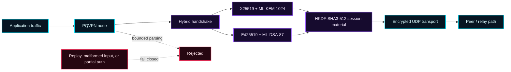

<div align="center">


# PQVPN

### PATHS CHANGE. KEYS ROTATE. THE GRID DOES NOT GET A VOTE.

An experimental C++23, post-quantum VPN node built to explore fail-closed
hybrid cryptography, resilient peer routing, and observable network defense.

[](https://en.cppreference.com/w/cpp/23)
[](LICENSE)
[](#verification-grid)
[](#project-status)

</div>

> [!WARNING]
> **PQVPN is experimental security software.** It passes the repository's
> automated hardening gate, but it has not received an independent security
> audit. Keep deployments bound to localhost until the protocol and
> implementation have been externally reviewed.

## Enter the tunnel

The network outside is noisy, observable, and hostile by default. PQVPN is a
migration of the immutable Python reference implementation in [`main.py`](main.py)
to a modular C++23 node. It focuses on explicit trust boundaries, bounded
network input, hybrid cryptography, replay resistance, key rotation, and a
runtime that shuts down cleanly instead of failing open.

This is an engineering project—not a claim of anonymity, production readiness,
or immunity from traffic analysis.

## Signal path



## Cryptographic perimeter

| Layer | Policy | Purpose |
|---|---|---|
| Authentication | Ed25519 **and** ML-DSA-87 | Both signatures cover the same SHA3-512 transcript digest. Partial authentication is rejected. |
| Key establishment | X25519 **and** ML-KEM-1024 | Classical and post-quantum shared secrets are combined rather than selected as fallbacks. |
| Derivation | HKDF-SHA3-512 | Produces role-separated send/receive keys, IV material, and a bound session identifier. |
| Password KDF | Argon2id | Enforces salt requirements and fails closed on provider errors. |
| Replay defense | Monotonic counters and bounded windows | Rejects malformed, duplicated, or stale nonce state. |

## Project status

The command-line node can load and validate configuration, run a smoke test,
dispatch bounded UDP datagrams, establish hybrid sessions, and enter a
signal-aware runtime loop. The optional Qt monitor and Windows TAP integration
are present.

The Windows TAP layer currently manages the adapter and media state. Automatic
peer selection, route installation, full bidirectional frame forwarding, an
independent audit, and broader deployment testing remain release blockers.

## Build on Ubuntu / WSL

Install CMake 3.28+, Ninja, a C++23 compiler, OpenSSL, Argon2, pkg-config, and
liboqs. CMake downloads pinned Asio and spdlog sources during the first
configure.

```bash
git clone https://github.com/tadaka9/PQVPN.git
cd PQVPN

cmake -S . -B build -G Ninja \
  -DCMAKE_BUILD_TYPE=Release \
  -DBUILD_TESTING=OFF
cmake --build build --target pqvpn_node
```

Enable the optional monitor with `-DPQVPN_BUILD_MONITOR=ON` after installing
the Qt 6 Core, Gui, Widgets, and Network development packages.

## Run the node

The checked-in [`config.json`](config.json) binds only to `127.0.0.1:9090`.

```bash
./build/pqvpn_node --smoke-test --config config.json
./build/pqvpn_node --config config.json
```

Stop with <kbd>Ctrl</kbd>+<kbd>C</kbd>. Run `./build/pqvpn_node --help` for the
available command-line options.

## Windows x64 and TAP

Build with the supplied [`mingw-toolchain.cmake`](mingw-toolchain.cmake),
install a TAP-Windows6 adapter, and use
[`Setup-PQVPNAdapter.ps1`](scripts/windows/Setup-PQVPNAdapter.ps1) from an
elevated PowerShell session. Pass `--tap-guid {GUID}` to select an adapter or
`--no-tap` for UDP-only operation.

## Verification grid

```bash
cmake -S . -B build-test -G Ninja \
  -DCMAKE_BUILD_TYPE=Debug \
  -DBUILD_TESTING=ON
cmake --build build-test -j2
ctest --test-dir build-test --output-on-failure -j2
```

The canonical suite covers loopback UDP dispatch, X25519 agreement, hybrid
authentication, hybrid session installation, HKDF-SHA3-512 combination,
ML-DSA-87 round trips, and the strict `pqvpn_hard_kernel` security gate.

A normal build or smoke-test does not imply that the hardening gate passes.
Treat every future gate finding as a release blocker.

## Repository map

```text
PQVPN/
├── src/                    C++23 node, modules, monitor, and platform code
├── include/                Public project headers
├── tests/                  Unit, integration, and parity tests
├── tools/                  Hardening and security validation
├── scripts/windows/        Windows TAP setup
├── external/               Required vendored single-header dependency
├── main.py                 Immutable behavioral reference
├── CMakeLists.txt          Build and test graph
├── MIGRATION_MANIFEST.md   Source-derived parity ledger
└── ROADMAP.md              Post-migration release work
```

Read [`MIGRATE.md`](MIGRATE.md) for the completed migration summary,
[`MIGRATION_MANIFEST.md`](MIGRATION_MANIFEST.md) for parity evidence,
[`ROADMAP.md`](ROADMAP.md) for remaining release work, and [`UPDATE.md`](UPDATE.md)
for the verified engineering history.

## Contributing and security

Contributions are welcome through focused pull requests. Start with
[`CONTRIBUTING.md`](CONTRIBUTING.md). Report suspected vulnerabilities privately
according to [`SECURITY.md`](SECURITY.md)—never in a public issue.

PQVPN is released under the [MIT License](LICENSE).

---

<div align="center">

## Fuel the resistance with Bitcoin

If PQVPN's open security research is useful to you, you can support continued
development with Bitcoin.

**`bc1qt6lrt8ces62pvp6ws9audr5mdhu0ht9qkga2ll`**

Verify the address in this repository before sending funds. Donations do not
purchase support, guarantees, influence, or security assurances.

</div>
