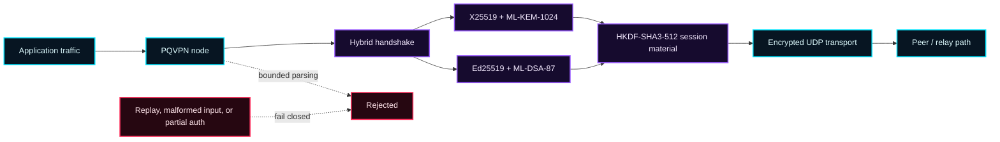

<div align="center">


# PQVPN

### PATHS CHANGE. KEYS ROTATE. THE GRID DOES NOT GET A VOTE.

**A free, private, post-quantum network between machines you already own.**
No central server. No account. No root. MIT licensed — the keys are yours,
the code is auditable, and the cryptography is built for the adversary that
hasn't been built yet.

[](https://en.cppreference.com/w/cpp/23)
[](LICENSE)
[](#six-native-targets)
[](#verification-grid)
[](#project-status)

</div>

---

## Why PQVPN exists

The network you use every day was designed for an era that no longer holds:

- Your traffic crosses routers, ISPs, and datacenters **that can read it** —
  and much of what they capture today is being archived for a reader that
  doesn't exist yet.
- Most VPNs outsource your privacy to a server operator you must trust, or to
  classical keys that "harvest now, decrypt later" threatens.
- The strong options want root, kernel modules, or a control plane you don't
  own.

PQVPN takes the opposite posture: **you run the network.** A few nodes on
machines you already have, joined by hybrid post-quantum handshakes, with
traffic that can bounce through your own relays and exit wherever you point
it — under normal user permissions. Free for everyone, because it is built by
everyone.

## What you get

| | |
|---|---|
| ⚛️ **Post-quantum from day one** | Every handshake combines X25519 **+** ML-KEM-1024 and Ed25519 **+** ML-DSA-87 over a SHA3-512 transcript. The classical half is never a fallback — it is fused with the post-quantum half, so captured handshakes stay useless to future readers. |
| 🕸️ **Your network, your keys** | Run a node and the network exists; add an endpoint to `bootstrap` and you are in. No accounts, no control plane, no telemetry. Admission is TOFU or an explicit allowlist — your call. |
| 🧅 **Onion relay paths** | Traffic can peel through several of your own nodes. Each layer is AEAD-bound to the exact forwarder identity allowed to unwrap it; replays and rogue injection fail closed. |
| 🚪 **Exit without elevation** | A node terminates client traffic into real outbound sockets with normal permissions: TCP/UDP bridging, ARP + gateway echo answers, IPv4 **and** IPv6, fragment reassembly, multi-client exits — verified end-to-end against live web endpoints. |
| 🛡️ **Fail-closed by construction** | Malformed frames, replayed nonces, partial authentication, ambiguous next-hops: rejected with a log line, never guessed at. A hardening gate enforces the posture in CI on every commit. |
| 🖥️ **Six native targets** | Linux x86_64 / ARM64 · macOS Intel / Apple Silicon · Windows x86_64 / ARM64 — each compiled by the portable matrix on every pull request. |

## Sixty-second tour

```text
CREATE a network                    JOIN one
┌─────────────┐   UDP    ┌─────────────┐        ┌─────────────┐
│  node A     │◄────────►│  node B     │        │ your laptop │
│ (yours)     │  hybrid  │ (a friend's)│        │ adds A+B to │
│ egress ON   │ handshake│ relay       │        │ bootstrap → │
└─────────────┘          └─────────────┘        │ session ✓   │
                                                └─────────────┘
```

1. **Create** — build the node, run it on any machine you own. It listens on a
   UDP port with its own hybrid identity (ed25519 + X25519 + ML-KEM-1024 +
   ML-DSA-87). Enable `egress` and it becomes an exit for the virtual subnet;
   leave it off and it is a pure relay.
2. **Join** — on another machine, add that endpoint to `bootstrap` in your
   config (and its public keys to `known_peers`). The hybrid handshake runs,
   the session installs, traffic flows. No registration anywhere.
3. **Extend** — point more nodes at each other and onion paths appear:
   laptop → relay A → relay B → exit. Every hop is one of your machines.

## Signal path



## Cryptographic perimeter

| Layer | Policy | Purpose |
|---|---|---|
| Authentication | Ed25519 **and** ML-DSA-87 | Both signatures cover the same SHA3-512 transcript digest. Partial authentication is rejected. |
| Key establishment | X25519 **and** ML-KEM-1024 | Classical and post-quantum shared secrets are combined rather than selected as fallbacks. |
| Derivation | HKDF-SHA3-512 | Produces role-separated send/receive keys, IV material, and a bound session identifier. |
| Password KDF | Argon2id | Enforces salt requirements and fails closed on provider errors. |
| Replay defense | Monotonic counters and bounded windows | Rejects malformed, duplicated, or stale nonce state — independently per replay domain (tunnel data vs relay layers). |

## How PQVPN positions against the field

Each project below solves a real problem; this table is about **posture**, not
quality. WireGuard is elegant, OpenVPN is battle-tested, Tailscale is superb
UX, AmneziaWG fights DPI — and none of them answer the question PQVPN asks:
*what if the network itself must survive the quantum transition without a
central party to trust?*

| | **PQVPN** | WireGuard | OpenVPN | Tailscale | AmneziaWG |
|---|---|---|---|---|---|
| Post-quantum key exchange | ✅ X25519 + ML-KEM-1024, fused | — classical only (X25519) | — classical (RSA/ECDH) | — WireGuard-based | — WireGuard fork |
| Central coordination required | ❌ peers you configure | optional, self-managed | usually a server operator | ✅ control plane (self-hostable) | optional |
| Elevation for typical use | ❌ egress runs unprivileged; one-time TAP setup on Windows | kernel module / often root for routing | frequently root | managed clients | similar to WireGuard |
| Multi-hop relay paths | ✅ onion relay through your nodes | via third-party tooling | via third-party tooling | — | — |
| Openness | MIT, fully open source | BSD-2-Clause, open | mostly open (OpenSSL) | core open; full product centers on their service | open source |

## Quickstart

### Build (Ubuntu / WSL shown; the matrix covers all six targets)

Install CMake 3.28+, Ninja, a C++23 compiler, OpenSSL, Argon2, pkg-config, and
liboqs. CMake downloads pinned Asio and spdlog sources during the first
configure.

```bash
git clone https://github.com/tadaka9/PQVPN.git
cd PQVPN

cmake -S . -B build -G Ninja \
  -DCMAKE_BUILD_TYPE=Release \
  -DBUILD_TESTING=OFF
cmake --build build --target pqvpn_node
```

Enable the optional monitor with `-DPQVPN_BUILD_MONITOR=ON` after installing
the Qt 6 Core, Gui, Widgets, and Network development packages.

### Run the node

The checked-in [`config.json`](config.json) binds only to `127.0.0.1:9090`.

```bash
./build/pqvpn_node --smoke-test --config config.json   # self-check first
./build/pqvpn_node --config config.json                # then run it
```

Stop with <kbd>Ctrl</kbd>+<kbd>C</kbd>. Run `./build/pqvpn_node --help` for the
available command-line options.

### Join a network (operator view)

```jsonc
{
  "network":   { "port": 9090, "bind_address": "127.0.0.1" },
  "bootstrap": [ "exit.example.org:8443", "relay.example.net:8443" ],
  "security":  { "tofu": true, "known_peers_file": "known_peers.yaml" }
}
```

`bootstrap` is the list of endpoints this node actively contacts until a
session exists; `known_peers` pins identities for admission. That is the whole
control plane: two files on disk that you own.

### Windows x64 and the tunnel adapter

Build with the supplied [`mingw-toolchain.cmake`](mingw-toolchain.cmake).

- **Driver-free (works today):** run `pqvpn_node.exe --no-tap`. The node is a
  full relay/exit — UDP transport, hybrid handshake, onion paths, egress exit —
  with no virtual adapter and no third-party driver in the data path.
- **PQVPN's own NDIS tunnel driver (Phase 2):** user-mode backend implemented
  (`WindowsOwnTunnel`), communicates via `\\.\PQVPN_TUN0`. Select with
  `--tap-guid own` or config `"tunnel": { "interface_name": "own" }`. Kernel
  driver Phase 1 scaffold complete; data path (Phase 2) in progress.
- **Transitional backends:** TAP-Windows6 (one-time setup via
  [`Setup-PQVPNAdapter.ps1`](scripts/windows/Setup-PQVPNAdapter.ps1) from an
elevated PowerShell session, then `--tap-guid {GUID}`) or Wintun (place
  `wintun.dll` next to the binary). See [`docs/windows-tunnel-adapter.md`](docs/windows-tunnel-adapter.md)
and the roadmap.

## Project status

> [!NOTE]
> **Experimental by design, verified by evidence.** PQVPN has not received an
> independent security audit — that is the next milestone, and it is public in
> [`ROADMAP.md`](ROADMAP.md). Until then: keep deployments bound to localhost,
> or run them where a compromise costs you nothing. Auditors and test peers are
> exactly who this project needs right now.

What works today, with merged evidence behind each line:

- Hybrid session establishment (X25519 + ML-KEM-1024 / Ed25519 + ML-DSA-87) over loopback UDP, both directions
- Onion relay with replay defense and forwarder binding — multi-hop chains driven through real dispatchers in tests
- User-space egress exit: TCP/UDP bridging (IPv4 + IPv6), ARP/gateway echo, fragment reassembly, multi-client exits — including a live-web end-to-end check
- Windows TAP data path with transactional route installation and liveness-based peer selection
- A 72-test CTest suite plus the `pqvpn_hard_kernel` hardening gate, green on every commit

What is next (tracked in [`ROADMAP.md`](ROADMAP.md)): protocol threat model,
independent security review, reproducible release packaging with provenance,
and operator documentation. The first production-oriented release will not be
declared until those have merged evidence.

## Six native targets

Every pull request compiles the node on all six — no cross-compiled guesses:

| Target | Runner | Toolchain |
|---|---|---|
| `linux-x86_64` | ubuntu-24.04 | GCC + Ninja, liboqs from source |
| `linux-arm64` | ubuntu-24.04-arm | GCC + Ninja, liboqs from source |
| `macos-x86_64` | macos-15-intel | AppleClang + Homebrew deps |
| `macos-arm64` | macos-15 | AppleClang + Homebrew deps |
| `windows-x86_64` | windows-2025 | MSVC (VS 2026) + vcpkg |
| `windows-arm64` | windows-11-arm | MSVC cross (ARM64) + vcpkg |

Each job verifies the binary's architecture and CLI startup, then uploads a
compile-only artifact. These artifacts are **not** release builds — see the
release criteria in [`ROADMAP.md`](ROADMAP.md).

## Platform adapters

The node attaches to one tunnel device per OS through a uniform, exception-free
adapter layer ([`src/platform/adapter.hpp`](src/platform/adapter.hpp)); every
operation reports its outcome by return value so the core never unwinds from
device code:

| OS | Adapter | When it cannot attach |
|---|---|---|
| Windows x64 / ARM64 | Driver-free relay/exit mode (`--no-tap`); transitional TAP-Windows (`--tap-guid`) or Wintun backends; destination is PQVPN's own NDIS tunnel driver ([design](docs/windows-tunnel-adapter.md)); transactional route installation in user mode | explicit `--no-tap`: relay/exit only, no local full tunnel. Adapter requested but unavailable: fail closed (exit 1) — a VPN node without its adapter is useless here |
| Linux | `/dev/net/tun` layer-3 interface (root or CAP_NET_ADMIN); address/route/DNS left to a network manager | warn and continue UDP-only |
| macOS | Network Extension boundary; an `NEPacketTunnelProvider` host plugs in the packet flow via `attach_extension()` | core-to-device writes drop until attached; node runs UDP-only |

The adapter contract (open / bidirectional delivery / close lifecycle) is
covered by [`tests/test_platform_adapter.cpp`](tests/test_platform_adapter.cpp),
which builds and runs on every OS.

## Verification grid

```bash
cmake -S . -B build-test -G Ninja \
  -DCMAKE_BUILD_TYPE=Debug \
  -DBUILD_TESTING=ON
cmake --build build-test -j2
ctest --test-dir build-test --output-on-failure -j2
```

The canonical suite covers loopback UDP dispatch, X25519 agreement, hybrid
authentication, hybrid session installation, HKDF-SHA3-512 combination,
ML-DSA-87 round trips, relay replay defense, egress bridging (unit + two-node
end-to-end), and the strict `pqvpn_hard_kernel` security gate.

In CI, every pull request additionally runs the six-target compile matrix and
CodeQL for both C/C++ and Python. A normal build or smoke-test does not imply
that the hardening gate passes — treat every future gate finding as a release
blocker.

## Configuration reference

| Section | Key | Default | Meaning |
|---|---|---|---|
| `security` | `strict_sig_verify`, `tofu`, `allowlist`, `known_peers_file`, `kdf.*` | see `config.json` | Peer admission policy and Argon2id KDF costs. |
| `network` | `port`, `bind_address` | `8080`, `0.0.0.0` | UDP transport endpoint. |
| `bootstrap` | `["host:port", ...]` | none | Peers the node actively contacts until a session exists. |
| `tuning` | `session_timeout_seconds` | `3600` | Prune horizon for idle sessions. |
| `tuning` | `keepalive_interval_seconds` | `30` | Tunnel PING cadence of the maintenance loop. |
| `tuning` | `liveness_window_seconds` | `90` | A peer silent longer than this is excluded from adapter traffic (must stay below `session_timeout_seconds`). |
| `tuning` | `handshake_timeout_seconds` | `30` | In-flight handshakes without an S2 are pruned after this. |
| `tuning` | `replay_window_size` | `1024` | Per-session nonce replay window (minimum 2). |
| `tuning` | `bootstrap_retry_seconds` | `10` | Seconds between bootstrap contact rounds. |
| `tunnel` | `interface_name` | empty | TUN name on Linux / TAP GUID on Windows; empty keeps the platform default (kernel-selected / auto-detect). CLI flags still win where they exist. |

Every `tuning` field is optional and must be positive when present; omitted
fields keep the built-in protocol defaults, so existing configs are unaffected.
The cryptographic algorithm set (Ed25519 + ML-DSA-87, X25519 + ML-KEM-1024,
HKDF-SHA3-512) and the wire frame types are fixed by design — they are
protocol identity enforced by the `pqvpn_hard_kernel` gate, not tunables.

## Repository map

```text
PQVPN/
├── src/                    C++23 node, modules, monitor, and platform code
├── include/                Public project headers
├── tests/                  Unit, integration, and parity tests
├── tools/                  Hardening and security validation
├── scripts/windows/        Windows TAP setup
├── external/               Required vendored single-header dependency
├── main.py                 Immutable Python reference that seeded this port
├── CMakeLists.txt          Build and test graph
├── MIGRATION_MANIFEST.md   Parity ledger + documented protocol deviations
└── ROADMAP.md              Post-migration release work
```

Read [`MIGRATE.md`](MIGRATE.md) for the completed migration summary,
[`MIGRATION_MANIFEST.md`](MIGRATION_MANIFEST.md) for parity evidence and the
documented wire-contract decisions, [`ROADMAP.md`](ROADMAP.md) for remaining
release work, and [`UPDATE.md`](UPDATE.md) for the verified engineering history.

## Contributing and security

Contributions are welcome through focused pull requests — test peers, auditors,
and platform builders especially. Start with
[`CONTRIBUTING.md`](CONTRIBUTING.md). Report suspected vulnerabilities privately
according to [`SECURITY.md`](SECURITY.md)—never in a public issue.

PQVPN is released under the [MIT License](LICENSE).

---

<div align="center">

## Fuel the resistance with Bitcoin

If PQVPN's open security research is useful to you, you can support continued
development — and the compute that keeps this grid honest — with Bitcoin.

**`bc1qt6lrt8ces62pvp6ws9audr5mdhu0ht9qkga2ll`**

Verify the address in this repository before sending funds. Donations do not
purchase support, guarantees, influence, or security assurances.

</div>
