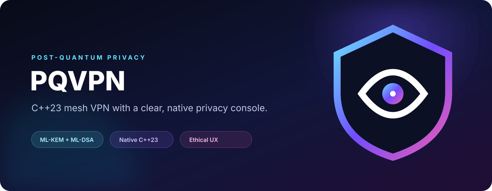
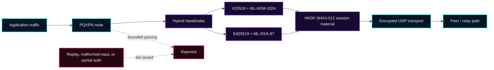
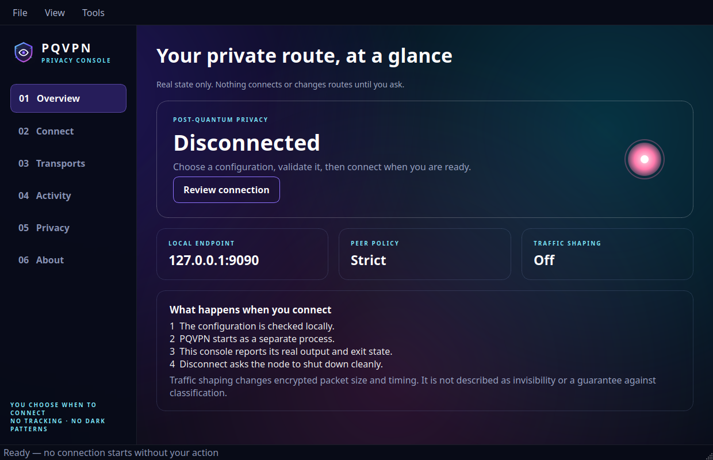
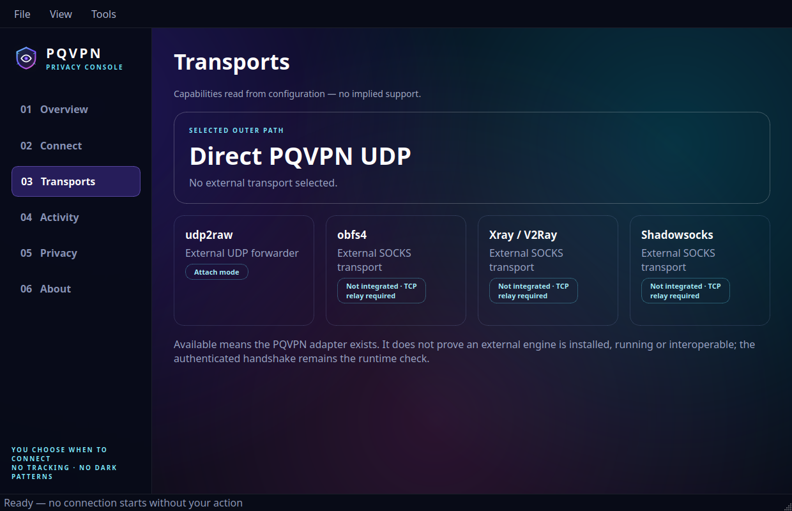

<div align="center">



# PQVPN

### PATHS CHANGE. KEYS ROTATE. THE GRID DOES NOT GET A VOTE.

**A free, private, post-quantum network between machines you already own.**
No central server. No account. No root. MIT licensed — the keys are yours,
the code is auditable, and the cryptography is built for the adversary that
hasn't been built yet.

[](https://en.cppreference.com/w/cpp/23)
[](LICENSE)
[](#native-ci-targets)
[](#verification-grid)
[](#project-status)

</div>

---

## Why PQVPN exists

The network you use every day was designed for an era that no longer holds:

- Your traffic crosses routers, ISPs, and datacenters **that can read it** —
  and much of what they capture today is being archived for a reader that
  doesn't exist yet.
- Most VPNs outsource your privacy to a server operator you must trust, or to
  classical keys that "harvest now, decrypt later" threatens.
- The strong options want root, kernel modules, or a control plane you don't
  own.

PQVPN takes the opposite posture: **you run the network.** A few nodes on
machines you already have, joined by hybrid post-quantum handshakes, with
traffic that can bounce through your own relays and exit wherever you point
it — under normal user permissions. Free for everyone, because it is built by
everyone.

## What you get

| | |
|---|---|
| ⚛️ **Post-quantum from day one** | Every handshake combines X25519 **+** ML-KEM-1024 and Ed25519 **+** ML-DSA-87 over a SHA3-512 transcript. The classical half is never a fallback — it is fused with the post-quantum half, so captured handshakes stay useless to future readers. |
| 🕸️ **Your network, your keys** | Run a node and the network exists; add an endpoint to `bootstrap` and you are in. No accounts, no control plane, no telemetry. Admission is TOFU or an explicit allowlist — your call. |
| 🧅 **Onion relay paths** | Traffic can peel through several of your own nodes. Each layer is AEAD-bound to the exact forwarder identity allowed to unwrap it; replays and rogue injection fail closed. |
| 🚪 **Exit without elevation** | A node terminates client traffic into real outbound sockets with normal permissions: TCP/UDP bridging, ARP + gateway echo answers, IPv4 **and** IPv6, fragment reassembly, multi-client exits — verified end-to-end against live web endpoints. |
| 🛡️ **Fail-closed by construction** | Malformed frames, replayed nonces, partial authentication, ambiguous next-hops: rejected with a log line, never guessed at. A hardening gate enforces the posture in CI on every commit. |
| ✨ **Native privacy console** | A colorful Qt 6 interface validates configuration with the real node, starts and stops it, reports actual process output, explains transport limits, and can stay available in the system tray. Motion is optional and no metric is simulated. |
| 🖥️ **Native CI targets** | Linux x86_64 / ARM64 · macOS Intel / Apple Silicon · Windows x86_64 — configure, compile and CLI smoke tests on native runners. |

## Sixty-second tour

```text
CREATE a network                    JOIN one
┌─────────────┐   UDP    ┌─────────────┐        ┌─────────────┐
│  node A     │◄────────►│  node B     │        │ your laptop │
│ (yours)     │  hybrid  │ (a friend's)│        │ adds A+B to │
│ egress ON   │ handshake│ relay       │        │ bootstrap → │
└─────────────┘          └─────────────┘        │ session ✓   │
                                                └─────────────┘
```

1. **Create** — build the node, run it on any machine you own. It listens on a
   UDP port with its own hybrid identity (ed25519 + X25519 + ML-KEM-1024 +
   ML-DSA-87). Enable `egress` and it becomes an exit for the virtual subnet;
   leave it off and it is a pure relay.
2. **Join** — on another machine, add that endpoint to `bootstrap` in your
   config (and its public keys to `known_peers`). The hybrid handshake runs,
   the session installs, traffic flows. No registration anywhere.
3. **Extend** — point more nodes at each other and onion paths appear:
   laptop → relay A → relay B → exit. Every hop is one of your machines.

## Signal path


```mermaid
flowchart LR
    A["Application traffic"] --> B["PQVPN node"]
    B --> C["Hybrid handshake"]
    C --> D["X25519 + ML-KEM-1024"]
    C --> E["Ed25519 + ML-DSA-87"]
    D --> F["HKDF-SHA3-512 session material"]
    E --> F
    F --> G["Encrypted UDP transport"]
    G --> H["Peer / relay path"]
    I["Replay, malformed input, or partial auth"] -. "fail closed" .-> X["Rejected"]
    B -. "bounded parsing" .-> X

    classDef node fill:#071522,stroke:#00e5ff,color:#dffcff,stroke-width:2px;
    classDef crypto fill:#160b2e,stroke:#9b5cff,color:#f4eaff,stroke-width:2px;
    classDef threat fill:#260711,stroke:#ff335f,color:#ffe5eb,stroke-width:2px;
    class A,B,G,H node;
    class C,D,E,F crypto;
    class I,X threat;
```

## Cryptographic perimeter

| Layer | Policy | Purpose |
|---|---|---|
| Authentication | Ed25519 **and** ML-DSA-87 | Both signatures cover the same SHA3-512 transcript digest. Partial authentication is rejected. |
| Key establishment | X25519 **and** ML-KEM-1024 | Classical and post-quantum shared secrets are combined rather than selected as fallbacks. |
| Derivation | HKDF-SHA3-512 | Produces role-separated send/receive keys, IV material, and a bound session identifier. |
| Password KDF | Argon2id | Enforces salt requirements and fails closed on provider errors. |
| Replay defense | Monotonic counters and bounded windows | Rejects malformed, duplicated, or stale nonce state — independently per replay domain (tunnel data vs relay layers). |

## How PQVPN positions against the field

Each project below solves a real problem; this table is about **posture**, not
quality. WireGuard is elegant, OpenVPN is battle-tested, Tailscale is superb
UX, AmneziaWG fights DPI — and none of them answer the question PQVPN asks:
*what if the network itself must survive the quantum transition without a
central party to trust?*

| | **PQVPN** | WireGuard | OpenVPN | Tailscale | AmneziaWG |
|---|---|---|---|---|---|
| Post-quantum key exchange | ✅ X25519 + ML-KEM-1024, fused | — classical only (X25519) | — classical (RSA/ECDH) | — WireGuard-based | — WireGuard fork |
| Central coordination required | ❌ peers you configure | optional, self-managed | usually a server operator | ✅ control plane (self-hostable) | optional |
| Elevation for typical use | relay/exit runs unprivileged; full tunnel needs adapter setup | kernel module / often root for routing | frequently root | managed clients | similar to WireGuard |
| Multi-hop relay paths | ✅ onion relay through your nodes | via third-party tooling | via third-party tooling | — | — |
| Openness | MIT, fully open source | BSD-2-Clause, open | mostly open (OpenSSL) | core open; full product centers on their service | open source |

## Quickstart

### Build (Ubuntu / WSL shown; the matrix covers five native targets)

Install CMake 3.28+, Ninja, a C++23 compiler, pkg-config, and the upstream
dependency versions listed in [`.github/dependencies.env`](.github/dependencies.env).
The native CI builds the official OpenSSL, Argon2 and liboqs releases on every
platform. CMake fetches Asio, spdlog, Catch2 and GoogleTest from their upstream
repositories, while the Privacy Console uses the official upstream Qt package.
An automated daily check proposes new stable releases and merges them only
after the complete protected CI matrix succeeds.

```bash
git clone https://github.com/tadaka9/PQVPN.git
cd PQVPN

cmake -S . -B build -G Ninja \
  -DCMAKE_BUILD_TYPE=Release \
  -DBUILD_TESTING=OFF
cmake --build build --target pqvpn_node
```

### Privacy Console

Install the Qt 6 Core, Gui and Widgets development packages, then build the
native C++23 interface beside the node:

```bash
cmake -S . -B build -G Ninja \
  -DCMAKE_BUILD_TYPE=Release \
  -DBUILD_TESTING=OFF \
  -DPQVPN_BUILD_MONITOR=ON
cmake --build build --target pqvpn_node pqvpn_monitor
./build/pqvpn_monitor
```

The console follows the same interaction model as DVX3 Backup Manager: a
focused sidebar, command palette, progressive disclosure, validation before
execution, plain-language feedback, session activity and remembered display
preferences. PQVPN adds an animated aurora, live connection orb, transport
capability view and system-tray controls. Close hides the window in the tray by
default without changing the connection; **Exit PQVPN** shuts the node down
first. Both behaviors are explicit and configurable.

The interface applies ethical UX principles: one dominant action per task,
no auto-connect, no telemetry, no urgency or fear prompts, no simulated
success, and no inflated claims about traffic shaping. **Reduce motion** stops
ambient, pulse and page animations. The Qt layer owns presentation and process
control only; cryptography, sessions, routing and transport remain in the
canonical `pqvpn_node` executable.

<div align="center">



<sub>Overview rendered by the real Qt application in its offscreen smoke test.</sub>

</div>

The transport screen separates an available adapter from external-engine
readiness, so an untested integration is never presented as working:



Linux x86_64 CI builds the GUI and renders the real window offscreen. Other
platforms retain their verified node baseline until a native GUI job passes.
For local visual verification:

```bash
QT_QPA_PLATFORM=offscreen \
PQVPN_SMOKE_IMAGE=pqvpn-console.png \
./build/pqvpn_monitor --smoke-test
```

### Run the node

The checked-in [`config.json`](config.json) binds only to `127.0.0.1:9090`.

```bash
./build/pqvpn_node --smoke-test --config config.json   # self-check first
./build/pqvpn_node --config config.json                # then run it
```

Stop with <kbd>Ctrl</kbd>+<kbd>C</kbd>. Run `./build/pqvpn_node --help` for the
available command-line options.

### Join a network (operator view)

```jsonc
{
  "network":   { "port": 9090, "bind_address": "127.0.0.1" },
  "bootstrap": [ "exit.example.org:8443", "relay.example.net:8443" ],
  "security":  { "tofu": true, "known_peers_file": "known_peers.yaml" }
}
```

`bootstrap` is the list of endpoints this node actively contacts until a
session exists; `known_peers` pins identities for admission. That is the whole
control plane: two files on disk that you own.

### Windows x64 and the tunnel adapter

Build with the supplied [`mingw-toolchain.cmake`](mingw-toolchain.cmake).

- **Relay/exit without a local adapter:** run `pqvpn_node.exe --no-tunnel`. The node is a
  full relay/exit — UDP transport, hybrid handshake, onion paths, egress exit —
  with no virtual adapter and no third-party driver in the data path.
- **PQVPN's own NDIS tunnel driver:** `WindowsOwnTunnel` communicates with
  `\\.\PQVPN_TUN0`; its bounded layer-3 queues bridge NDIS packets to the C++23
  node. Install a locally or publicly signed driver package with
  [`Setup-PQVPNAdapter.ps1`](scripts/windows/Setup-PQVPNAdapter.ps1). TAP-Windows
  and Wintun are disabled and are not runtime fallbacks. See
  [`docs/windows-tunnel-adapter.md`](docs/windows-tunnel-adapter.md).

## Project status

> [!NOTE]
> **Experimental by design, verified by evidence.** PQVPN has not received an
> independent security audit — that is the next milestone, and it is public in
> [`ROADMAP.md`](ROADMAP.md). Until then: keep deployments bound to localhost,
> or run them where a compromise costs you nothing. Auditors and test peers are
> exactly who this project needs right now.

What works today, with merged evidence behind each line:

- Hybrid session establishment (X25519 + ML-KEM-1024 / Ed25519 + ML-DSA-87) over loopback UDP, both directions
- Onion relay with replay defense and forwarder binding — multi-hop chains driven through real dispatchers in tests
- User-space egress exit: TCP/UDP bridging (IPv4 + IPv6), ARP/gateway echo, fragment reassembly, multi-client exits — including a live-web end-to-end check
- Windows TAP data path with transactional route installation and liveness-based peer selection
- A 72-test CTest suite plus the `pqvpn_hard_kernel` hardening gate, green on every commit

What is next (tracked in [`ROADMAP.md`](ROADMAP.md)): protocol threat model,
independent security review, reproducible release packaging with provenance,
and operator documentation. The first production-oriented release will not be
declared until those have merged evidence.

## Native CI targets

The matrix follows Dvx3-Backup-Manager: Linux x86_64/ARM64, macOS Intel/ARM64, and Windows x64. Every pull request and push to `main` or `future` must configure, compile, run `--help`, and run `--smoke-test --config config.json` on each native runner. A platform is verified only when its job passes for the relevant commit.

| Target | Runner | Toolchain |
|---|---|---|
| `linux-x86_64` | ubuntu-24.04 | GCC + Ninja, liboqs from source |
| `linux-arm64` | ubuntu-24.04-arm | GCC + Ninja, liboqs from source |
| `macos-x86_64` | macos-15-intel | AppleClang + Homebrew deps |
| `macos-arm64` | macos-15 | AppleClang + Homebrew deps |
| `windows-x86_64` | windows-2025 | MSVC (VS 2026) + vcpkg; Windows 10+ target |

Windows ARM64 is outside this baseline and is not claimed as verified.
The Windows driver workflow restores Microsoft's supported WDK package, builds
the x64 kernel driver, compiles the IRP test utility, and validates the HLK plan.
The CI artifact is unsigned; public Windows loading still requires Microsoft
attestation signing and the native release gate.

Each job verifies the binary architecture, `--help`, and both configuration
smoke tests. A `v*` tag creates an immutable GitHub prerelease only after all
five native matrix entries succeed; ordinary branch runs retain CI artifacts.

## Platform adapters

The node attaches to one tunnel device per OS through a uniform, exception-free
adapter layer ([`src/platform/adapter.hpp`](src/platform/adapter.hpp)); every
operation reports its outcome by return value so the core never unwinds from
device code:

| OS | Adapter | When it cannot attach |
|---|---|---|
| Windows x64 | PQVPN's own NDIS layer-3 tunnel driver ([design](docs/windows-tunnel-adapter.md)); transactional route installation in user mode | explicit `--no-tunnel`: relay/exit only. Adapter requested but unavailable: fail closed (exit 1) |
| Linux | `/dev/net/tun` layer-3 interface (root or CAP_NET_ADMIN); address/route/DNS left to a network manager | warn and continue UDP-only |
| macOS | Network Extension boundary; an `NEPacketTunnelProvider` host plugs in the packet flow via `attach_extension()` | core-to-device writes drop until attached; node runs UDP-only |

The adapter contract (open / bidirectional delivery / close lifecycle) is
covered by [`tests/test_platform_adapter.cpp`](tests/test_platform_adapter.cpp),
which builds and runs on every OS.

## Verification grid

```bash
cmake -S . -B build-test -G Ninja \
  -DCMAKE_BUILD_TYPE=Debug \
  -DBUILD_TESTING=ON
cmake --build build-test -j2
ctest --test-dir build-test --output-on-failure -j2
```

The canonical suite covers loopback UDP dispatch, X25519 agreement, hybrid
authentication, hybrid session installation, HKDF-SHA3-512 combination,
ML-DSA-87 round trips, relay replay defense, egress bridging (unit + two-node
end-to-end), and the strict `pqvpn_hard_kernel` security gate.

In CI, every pull request additionally runs the five-target native build and smoke-test matrix and
CodeQL for C/C++. Build, tests and hardening require no Python interpreter.
A normal build or smoke-test does not imply
that the hardening gate passes — treat every future gate finding as a release
blocker.

## Configuration reference

| Section | Key | Default | Meaning |
|---|---|---|---|
| `security` | `strict_sig_verify`, `tofu`, `allowlist`, `known_peers_file`, `kdf.*` | see `config.json` | Peer admission policy and Argon2id KDF costs. |
| `network` | `port`, `bind_address` | `8080`, `0.0.0.0` | UDP transport endpoint. |
| `bootstrap` | `["host:port", ...]` | none | Peers the node actively contacts until a session exists. |
| `tuning` | `session_timeout_seconds` | `3600` | Prune horizon for idle sessions. |
| `tuning` | `keepalive_interval_seconds` | `30` | Tunnel PING cadence of the maintenance loop. |
| `tuning` | `liveness_window_seconds` | `90` | A peer silent longer than this is excluded from adapter traffic (must stay below `session_timeout_seconds`). |
| `tuning` | `handshake_timeout_seconds` | `30` | In-flight handshakes without an S2 are pruned after this. |
| `tuning` | `replay_window_size` | `1024` | Per-session nonce replay window (minimum 2). |
| `tuning` | `bootstrap_retry_seconds` | `10` | Seconds between bootstrap contact rounds. |
| `tunnel` | `interface_name` | empty | TUN name on Linux / TAP GUID on Windows; empty keeps the platform default (kernel-selected / auto-detect). CLI flags still win where they exist. |

Every `tuning` field is optional and must be positive when present; omitted
fields keep the built-in protocol defaults, so existing configs are unaffected.
The cryptographic algorithm set (Ed25519 + ML-DSA-87, X25519 + ML-KEM-1024,
HKDF-SHA3-512) and the wire frame types are fixed by design — they are
protocol identity enforced by the `pqvpn_hard_kernel` gate, not tunables.

## Repository map

```text
PQVPN/
├── src/                    C++23 node, modules, monitor, and platform code
├── include/                Public project headers
├── tests/                  Unit, integration, and parity tests
├── tools/                  Hardening and security validation
├── scripts/windows/        Windows TAP setup
├── external/               Required vendored single-header dependency
├── main.py                 Immutable Python reference that seeded this port
├── CMakeLists.txt          Build and test graph
├── MIGRATION_MANIFEST.md   Parity ledger + documented protocol deviations
└── ROADMAP.md              Post-migration release work
```

Read [`MIGRATE.md`](MIGRATE.md) for the completed migration summary,
[`MIGRATION_MANIFEST.md`](MIGRATION_MANIFEST.md) for parity evidence and the
documented wire-contract decisions, [`ROADMAP.md`](ROADMAP.md) for remaining
release work, and [`UPDATE.md`](UPDATE.md) for the verified engineering history.

## Contributing and security

External UDP transport attachment and optional C++23 online traffic shaping
are described in [`docs/external-transports.md`](docs/external-transports.md).
[`config.udp2raw.json`](config.udp2raw.json) attaches to a separately managed
loopback udp2raw engine; it never falls back to a public mesh destination.
TCP/SOCKS engines require a separate relay and are not yet supported.

Contributions are welcome through focused pull requests — test peers, auditors,
and platform builders especially. Start with
[`CONTRIBUTING.md`](CONTRIBUTING.md). Report suspected vulnerabilities privately
according to [`SECURITY.md`](SECURITY.md)—never in a public issue.

PQVPN is released under the [MIT License](LICENSE).

---

<div align="center">

## Fuel the resistance with Bitcoin

If PQVPN's open security research is useful to you, you can support continued
development — and the compute that keeps this grid honest — with Bitcoin.

**`bc1qt6lrt8ces62pvp6ws9audr5mdhu0ht9qkga2ll`**

Verify the address in this repository before sending funds. Donations do not
purchase support, guarantees, influence, or security assurances.

</div>
